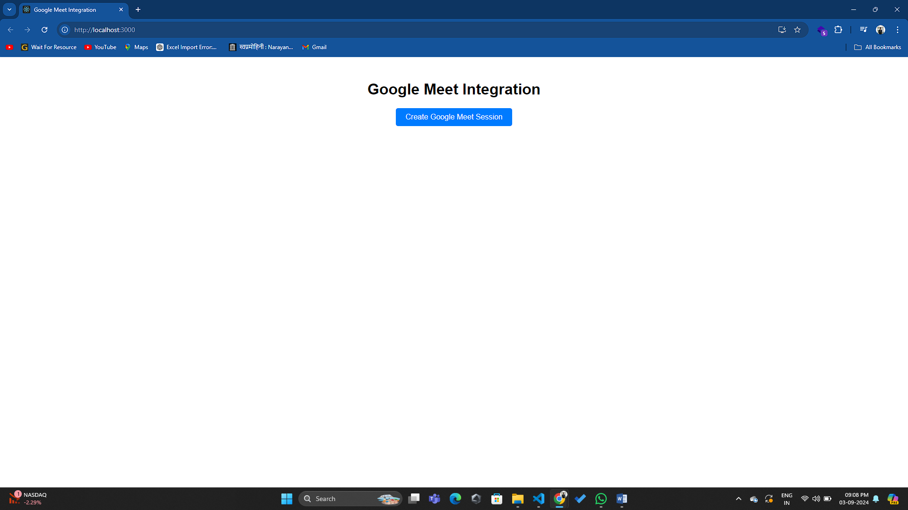
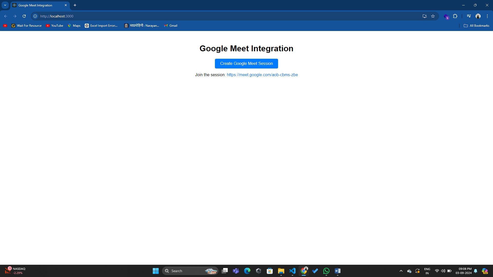

# Google Meet Integration

## Overview

This project is a simple web application that integrates Google Meet for chat, voice, and video call sessions. Users can create and join Google Meet sessions directly from the application.



## Features

- **Create Google Meet Sessions:** Easily schedule new sessions.
- **Join Sessions:** Access meetings via provided links.
- **Minimalistic User Interface:** Clean and straightforward design.



## Technologies Used

- **Frontend:** React
- **Backend:** Node.js, Express
- **Google Meet Integration:** Google Calendar API
- **Environment Variables:** Dotenv for managing environment settings

## Setup Instructions

### Prerequisites

- **Node.js:** v14 or later
- **npm:** v6 or later, or **yarn**

### Getting Started

1. **Clone the Repository**

   ```bash
   git clone https://github.com/Adarshpadval/google-meet-integration.git
   cd google-meet-integration
   
### For the frontend (google-meet-integration):

Navigate to the google-meet-integration directory in the terminal.
Run npm install to install dependencies.
Start the React app with npm start.
For the backend:

### Navigate to the backend directory in the terminal.
Run npm install to install dependencies.
Create a .env file and replace the placeholder values with your actual API keys.
Start the Node.js server with node index.js.

   
### Summary of Changes:
- Added separate setup instructions for the frontend and backend.
- Included steps to install dependencies and start each part of the application.
- Updated the instructions to replace keys in the `.env` file.
  
